# Counter Fresh

<p align="center">
  <strong>An animated multi-participant score tracker and tally counter.</strong><br />
  Built with <strong>Fresh 2</strong>, <strong>Preact Signals</strong>, and <strong>Tailwind CSS v4</strong>, runnable on the <strong>Web</strong> and as a <strong>Desktop</strong> app via <strong>Deno</strong>.
</p>

<p align="center">
  
  
  
  
  
  
</p>

---

##  Features

- 
  **Live Sorting**: Add participants and update their scores. Cards
  automatically re-order by score (descending) with stable tie-breaking.
- 
  **Animated Re-ordering**: Uses the
  [FLIP (First, Last, Invert, Play) technique](https://css-tricks.com/animating-layouts-with-the-flip-technique/)
  to smoothly slide cards into their new positions when scores change.

- 
  **Hold to Delete**: Long-press the delete button (~850ms) to remove a
  participant. Displays a rising fill and shake animation, and cancels safely if
  released early.
- 
  **Canvas Background**: Animated HTML5 canvas background with falling glyphs,
  spotlight effects, and a blueprint grid pattern.
- 
  **Web & Desktop Support**: Run in the browser during web development or build
  as a desktop application using Deno Desktop (CEF backend).
- 
  **Desktop Window Controls**: Provides a window close button and <kbd>Esc</kbd>
  key shortcut wired to Deno Desktop bindings.
- 
  **Tailwind CSS & Custom Theme**: Styled using Tailwind CSS v4, custom OKLCH
  color palettes, and fonts (_Righteous_ and _JetBrains Mono_).

---

##  Tech Stack

| Layer                    | Technology                                                                                     |
| ------------------------ | ---------------------------------------------------------------------------------------------- |
| **Runtime & Toolchain**  | [Deno 2](https://deno.com/)                                                                    |
| **Web Framework**        | [Fresh 2](https://fresh.deno.dev/) (`@fresh/core`, `@fresh/plugin-vite`)                       |
| **UI Library**           | [Preact](https://preactjs.com/) + [`@preact/signals`](https://preactjs.com/guide/v10/signals/) |
| **Desktop Shell**        | [Deno Desktop](https://docs.deno.com/) (Chromium Embedded Framework backend)                   |
| **Dev Server & Bundler** | [Vite 7](https://vitejs.dev/)                                                                  |
| **Styling**              | [Tailwind CSS v4](https://tailwindcss.com/) + `@tailwindcss/vite`                              |

---

##  Animation & Mechanics Implementation

<p align="center">
  
</p>

All animations across the project are implemented with native Web APIs and CSS,
without external animation dependencies:

- **Vanilla FLIP Layouts
  ([`ParticipantList.tsx`](./islands/ParticipantList.tsx)):** Card re-ordering
  is animated using the FLIP (_First, Last, Invert, Play_) technique inside
  `useLayoutEffect`. Previous and next card bounding boxes are measured via
  `getBoundingClientRect()`, inverted using CSS transforms
  (`translate(deltaX, deltaY)`), and transitioned to their target positions on
  the next animation frame.
- **Topology-Matched Path Morphing
  ([`ParticipantIcon.css`](./components/ParticipantIcon/ParticipantIcon.css)):**
  The `+` add icon morphs into a user avatar on hover using CSS `d: path(...)`
  transitions. Both shapes share identical cubic Bézier segment topologies,
  enabling the browser to interpolate the path geometry without JavaScript.
- **Stateful Hold-to-Delete ([`Participant.tsx`](./islands/Participant.tsx)):**
  The 850ms hold interaction runs on a `requestAnimationFrame` loop driven by
  `performance.now()`. Releasing early triggers a dynamic drain loop that
  rewinds progress back to 0 proportionally instead of resetting instantly.
- **Dual-Layer Canvas Background
  ([`GlyphsBackground.tsx`](./islands/GlyphsBackground.tsx)):** To avoid
  redundant per-frame redraws of static blueprint geometry, the background dot
  grid and frame guides are drawn once to an offscreen canvas. The active canvas
  renders falling glyphs and uses `destination-out` composite operations for
  radial spotlight masking.

---

##  Project Structure

```text
CounterFresh/
├── assets/                 # Stylesheets, theme configuration & showcase media
│   ├── demo/               # Documentation animation assets & previews
│   │   └── participant-morph.svg # Animated SVG demo preview
│   └── styles.css          # Tailwind CSS v4 setup, OKLCH tokens & keyframe animations

├── components/             # Reusable UI components & SVG icons
│   ├── CounterIcons/       # Plus and Minus SVG icons
│   ├── DeleteIcon/         # Animated delete icon
│   ├── ParticipantIcon/    # Add participant icon
│   ├── Button.tsx          # Base styled button
│   ├── HoldDeleteButton.tsx# Reusable hold-to-delete trigger
│   └── Surface.tsx         # Translucent card container
├── islands/                # Interactive Preact islands (client-hydrated)
│   ├── CloseButton.tsx     # Desktop window close trigger & keybinds
│   ├── Countdown.tsx       # Animated countdown island
│   ├── Counter.tsx         # Score increment/decrement island
│   ├── GlyphsBackground.tsx# Animated canvas background
│   ├── Participant.tsx     # Participant card with hold-to-delete logic
│   └── ParticipantList.tsx # FLIP-animated leaderboard list
├── routes/                 # File-system routing
│   ├── api/                # API route handlers
│   │   └── [name].tsx      # Sample API handler
│   ├── _app.tsx            # Global HTML document shell & background mounting
│   ├── about.tsx           # About page
│   └── index.tsx           # Home page
├── static/                 # Static public assets (favicons, logos)
├── icons/                  # Application icons for desktop builds
├── bindings.d.ts           # Desktop native bindings TypeScript definitions
├── client.ts               # Client entry point for Vite HMR & assets
├── deno.json               # Deno configuration, tasks, desktop settings & imports
├── main.ts                 # Fresh 2 server entry point & desktop window lifecycle
└── vite.config.ts          # Vite plugin configuration
```

---

##  Getting Started

### Prerequisites

Make sure you have
[Deno 2.x](https://docs.deno.com/runtime/getting_started/installation)
installed:

```bash
# macOS / Linux
curl -fsSL https://deno.land/install.sh | sh

# Windows (PowerShell)
irm https://deno.land/install.ps1 | iex
```

### Installation

Clone the repository and enter the directory:

```bash
git clone https://github.com/your-username/CounterFresh.git
cd CounterFresh
```

---

##  Development

### Web Development Mode

Starts the Vite development server with HMR:

```bash
deno task dev
```

Open [http://localhost:5173](http://localhost:5173) in your browser.

### Desktop Development Mode

Launches the application in a desktop window with HMR:

```bash
deno task d-dev
```

### Formatting & Type Checks

Run format check, linter, and typechecker:

```bash
deno task check
```

---

##  Building for Production

### 1. Web Production Build

Build client assets and start the production server:

```bash
# Build client assets
deno task build

# Start server
deno task start
```

### 2. Standalone Desktop Build

Package the application as a standalone desktop binary:

```bash
deno task d-build
```

Output directory (`dist/`):

- **macOS**: `dist/CounterFresh.app`
- **Windows**: `dist/CounterFresh.exe`
- **Linux**: `dist/counter-fresh`

---

##  Desktop Configuration

Desktop packaging options are configured under the `"desktop"` key in
[`deno.json`](file:///home/rcutte/Work/tries/2026-08-10-FreshCounterDesktop/CounterFresh/deno.json):

```json
{
  "desktop": {
    "app": {
      "name": "Counter Fresh",
      "identifier": "com.example.myapp",
      "icons": {
        "macos": "./icons/app.png",
        "windows": "./icons/app.ico",
        "linux": "./icons/app.png"
      },
      "deepLinks": ["counter-fresh"]
    },
    "backend": "cef",
    "output": {
      "macos": "./dist/CounterFresh.app",
      "windows": "./dist/CounterFresh",
      "linux": "./dist/counter-fresh"
    }
  }
}
```

---

##  Controls & Interactions

| Action                 | Control / Interaction                                                                                        | Description                                              |
| ---------------------- | ------------------------------------------------------------------------------------------------------------ | -------------------------------------------------------- |
| **Add Participant**    | Click <kbd>+</kbd> at the bottom                                                                             | Adds a new participant card                              |
| **Change Score**       | Click <kbd>+</kbd> / <kbd>−</kbd>                                                                            | Increases or decreases score                             |
| **Edit Name**          | Click name input                                                                                             | Edits participant name                                   |
| **Delete Participant** | **Hold** the  button (850ms) | Fills progress bar and shakes before confirming deletion |
| **Cancel Deletion**    | Release before 850ms                                                                                         | Drains progress back to 0                                |
| **Close Desktop App**  | Click top-right ✕ or press <kbd>Esc</kbd>                                                                    | Closes the window / exits the application                |

---

##  License

This project is open-source. See the repository license for details.
